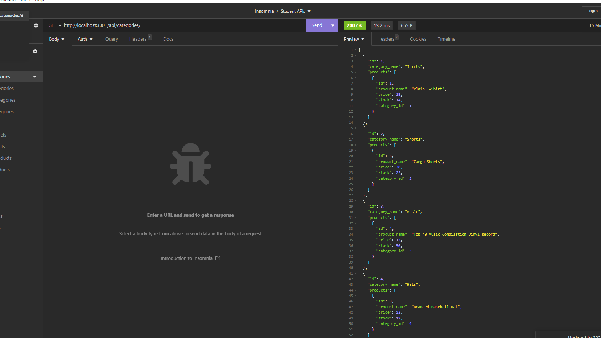

# E-commerce Back End API

## Description
This application allows an and E-Commerce company to manage their database using mySQL2 and Sequilize.  This provides the back end work that can be hooked up to their front end web application.

## Table of Contents (if applicable)

- [Description](#description)
- [Features](#features)
- [Installation](#installation)
- [Usage](#usage)
- [License](#license)
- [Contact Info](#contact-info)

## Features

- Allows User to hook up their database and view multiple aspects
- Saves all information dynamically to the server database
- Allows easy routing to create, retrieve, update, and delete items that are linked with multiple associations

## Installation

Please be sure to have node.js installed on your computer. Clone the repo into your folder. Make sure you have mysql2, express.js, console.table, and inquirer already installed as well by using npm install.  Open the terminal and run 'mysql -u root -p' and use the password "spamANDeggs" when prompted. Then type 'source C:\Users\ayden\Bootcamp\E-commerce-Back-End\Develop\db\schema.sql' to initialize the database. Type 'exit' to get out of mySQL and type 'npm run seed' to seed data to play with in to the database.  Lastly to run the program just type in 'npm start'

## Usage
Use insomnia to run different get, push, put, and delete routes for http://localhost:3001/api/products http://localhost:3001/api/categories http://localhost:3001/api/tags. All of these actions are live with the database and will affect it so be careful and precise on what you want to create, add, or delete. 

[How to use the E-Commerce Back End API](https://drive.google.com/file/d/1oXeesaLibs7sXwsf1OvSyz6b5pNa9maA/view)

## License
This project is covered under the MIT [License](https://choosealicense.com/licenses/${license}).

## Contact Info

- Github: [https://github.com/markthos](https://github.com/https://github.com/markthos)
- Email: aydenthos@gmail.com